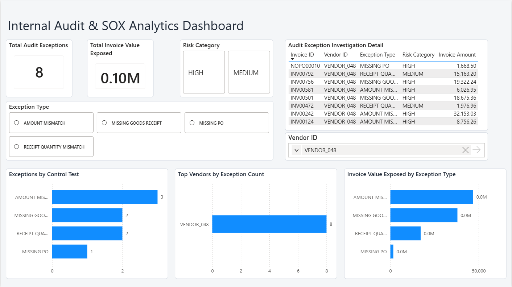

# Internal Audit & SOX Analytics Dashboard

An end-to-end audit analytics project designed to identify control exceptions in the procure-to-pay process.

The project uses Python to generate simulated ERP transaction data, PostgreSQL and SQL to perform audit control testing, and Power BI to investigate exceptions through an interactive dashboard.

## Business Problem

Internal audit teams often need to review large volumes of invoice, purchase order, and goods receipt data to identify potential control failures.

This project analyzes procure-to-pay transactions and flags exceptions related to three-way matching and duplicate payment risk. The goal is to help auditors prioritize high-risk transactions and investigate patterns across vendors and control tests.

## Process

1. Generated a synthetic ERP dataset containing purchase orders, goods receipts, and invoices using Python.
2. Loaded the ERP transaction data into PostgreSQL for structured audit testing.
3. Developed SQL control tests to identify duplicate payments and three-way match exceptions.
4. Validated exception logic and reconciled control-test results to the underlying transaction data.
5. Created PostgreSQL reporting views to provide a clean audit exception layer for Power BI.
6. Connected Power BI directly to PostgreSQL and built an interactive internal audit dashboard.
7. Added risk, exception type, and vendor filters to support transaction-level investigation.

## Audit Control Tests

### Duplicate Payment Detection

Identified invoices with the same vendor, purchase order, and invoice amount processed more than once. The test identified 25 duplicate groups representing $340,668.16 in potential duplicate payment exposure.

### Three-Way Match Testing

Compared invoice transactions against purchase orders and goods receipts to identify control exceptions involving:

- Invoice amount mismatches
- Purchase order quantity mismatches
- Goods receipt quantity mismatches
- Missing purchase orders
- Missing goods receipts

The three-way match testing identified 214 flagged invoice records with $3.15 million in invoice value associated with control exceptions.

## Key Findings

- The audit testing identified 214 three-way match exceptions across the invoice population.
- Amount mismatches were the most frequent exception type, representing the largest concentration of flagged transactions.
- The flagged invoice population represented approximately $3.15 million in invoice value exposed to control exceptions.
- Duplicate payment testing identified 25 duplicate groups with $340,668.16 in potential duplicate payment exposure.
- Vendor-level analysis showed that exceptions were distributed across multiple vendors rather than being driven by a single vendor.
- Transaction-level investigation capabilities allow audit teams to filter exceptions by control test, risk category, and vendor.

## Control Remediation Recommendations

Based on the exception patterns identified through the audit testing, the following control improvements are recommended:

- Implement automated duplicate invoice checks using vendor, purchase order, and invoice amount combinations before payment approval.
- Require unresolved three-way match exceptions to enter an approval workflow before invoices are released for payment.
- Establish tolerance thresholds for invoice amount and quantity variances and require documented approval for exceptions exceeding those thresholds.
- Prevent invoice processing when a valid purchase order is required but missing.
- Require goods receipt confirmation before payment for applicable purchase order transactions.
- Monitor vendor-level exception trends to identify recurring control failures and prioritize targeted reviews.
- Develop recurring exception monitoring to provide finance and internal audit teams with timely visibility into control risks.

## Power BI Dashboard

The Power BI dashboard provides an executive view of control exceptions and supports transaction-level audit investigation.

Dashboard features include:

- Total audit exception KPI
- Total invoice value exposed KPI
- Exceptions by control test
- Invoice value exposed by exception type
- Vendor-level exception concentration analysis
- Audit exception investigation detail
- Interactive filtering by exception type, risk category, and vendor



## Tech Stack

- Python — synthetic ERP data generation
- PostgreSQL — relational database and reporting layer
- SQL — audit control testing and exception analysis
- Power BI — executive dashboard and interactive investigation
- VS Code — project development and repository management

## Project Structure

```text
Internal-Audit-SOX-Analytics/
├── data/
│   ├── purchase_orders.csv
│   ├── goods_receipts.csv
│   └── invoices.csv
├── docs/
│   └── internal_audit_sox_dashboard.png
├── powerbi/
│   └── Internal_Audit_SOX_Analytics_Dashboard.pbix
├── python/
│   └── generate_erp_data.py
├── sql/
│   ├── audit_control_tests.sql
│   └── audit_summary.sql
├── README.md
├── .gitignore
└── requirements.txt

```

## How to Run

1. Clone the repository.
2. Install the required Python packages using `pip install -r requirements.txt`.
3. Run `python python/generate_erp_data.py` to generate the synthetic ERP datasets.
4. Create a PostgreSQL database and load the generated CSV files into the purchase order, goods receipt, and invoice tables.
5. Run the SQL control tests in `sql/audit_control_tests.sql`.
6. Run `sql/audit_summary.sql` to create the audit reporting views.
7. Open the Power BI dashboard and connect it to the PostgreSQL reporting views.